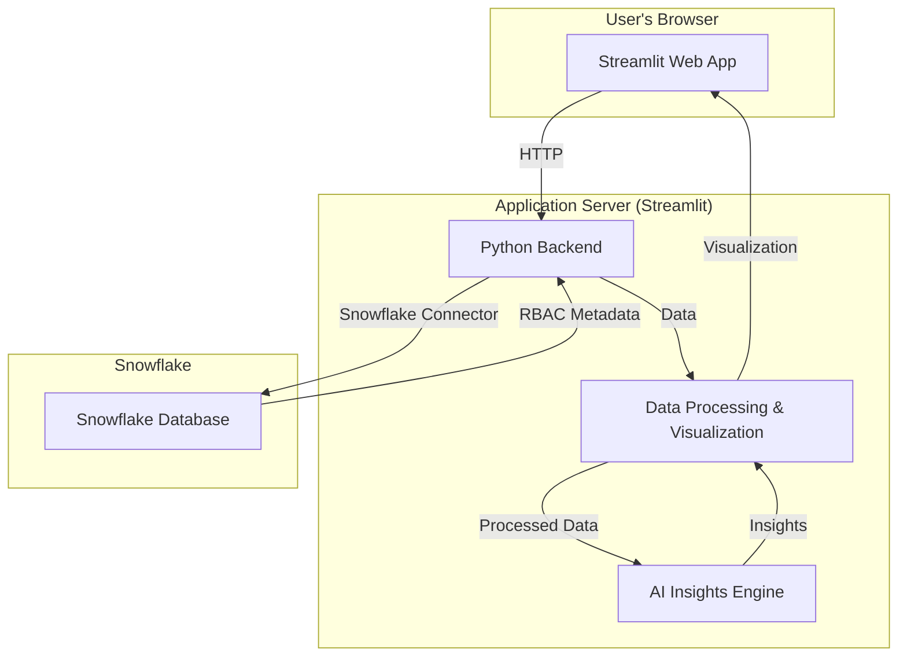

# System Architecture: Snowflake RBAC Visualization Tool

## 1. Overview

This document describes the architecture for the Snowflake RBAC Visualization Tool. The system is designed as a web application using Streamlit and Python, with Snowflake as the backend data source. This architecture is chosen for its simplicity, rapid development capabilities, and seamless integration with Snowflake.

## 2. Architectural Diagram



## 3. Component Breakdown

### 3.1. Frontend: Streamlit

- **Framework:** Streamlit
- **Description:** The user interface will be built using Streamlit, a Python framework that makes it easy to create beautiful, custom web apps for machine learning and data science. It allows for rapid prototyping and development, which is ideal for a hackathon project.
- **Key Responsibilities:**
    - Rendering the interactive graph visualization.
    - Providing UI components for filtering, search, and drill-down views.
    - Displaying AI-powered insights and recommendations.

### 3.2. Backend: Python

- **Language:** Python
- **Description:** The backend logic will be written in Python and will be tightly integrated with the Streamlit application.
- **Key Libraries:**
    - `snowflake-connector-python`: For connecting to and querying the Snowflake database.
    - `pandas`: For efficient data manipulation and transformation of the RBAC data fetched from Snowflake.
    - `streamlit-agraph` or `pyvis`: For generating and rendering the interactive graph visualizations.
    - `scikit-learn` (optional): For implementing the AI-powered anomaly detection and insights.
- **Key Responsibilities:**
    - Managing the connection to Snowflake.
    - Executing `SHOW` commands to fetch RBAC metadata.
    - Processing and transforming the raw data into a format suitable for visualization.
    - Implementing the logic for the AI insights engine.

### 3.3. Database: Snowflake

- **Platform:** Snowflake
- **Description:** Snowflake will serve as the primary data source for the application. The tool will not store any data itself but will query the Snowflake account's metadata directly.
- **Key Responsibilities:**
    - Storing and managing the RBAC roles, grants, and object metadata.
    - Executing the queries sent from the Python backend and returning the results.

## 4. Data Flow

1.  **User Interaction:** The user accesses the Streamlit web application in their browser.
2.  **Data Fetching:** The Python backend, triggered by the Streamlit app, establishes a secure connection to the user's Snowflake account. It then executes `SHOW GRANTS`, `SHOW ROLES`, and other relevant SQL commands.
3.  **Data Processing:** The fetched data (in tabular format) is processed and transformed using `pandas`. This involves creating relationship mappings between users, roles, and objects to build a graph structure.
4.  **AI Analysis:** The processed data is fed into the AI Insights Engine, which analyzes the RBAC structure for anomalies, compliance violations, and optimization opportunities.
5.  **Visualization:** The processed data, along with the AI-generated insights, is passed to the visualization library (`streamlit-agraph`), which renders an interactive graph in the Streamlit frontend.
6.  **User Exploration:** The user can interact with the graph—clicking on nodes, filtering, and drilling down to see more details. These interactions trigger further data processing and view updates within the Streamlit app.

## 5. Proposed Project Structure

```
rbac_view/
├── .streamlit/
│   └── config.toml
├── assets/
│   └── logo.png
├── modules/
│   ├── ai_insights.py
│   ├── data_loader.py
│   └── graph_visualizer.py
├── app.py
├── architecture.md
├── requirements.txt
└── requirement.md
```

- **`.streamlit/config.toml`**: Configuration file for the Streamlit application (e.g., theme settings).
- **`assets/`**: To store static assets like images and logos.
- **`modules/`**: A directory to organize the Python code into logical modules.
  - **`data_loader.py`**: Contains functions for connecting to Snowflake and fetching data.
  - **`graph_visualizer.py`**: Contains functions for creating and customizing the graph visualization.
  - **`ai_insights.py`**: Contains the logic for the AI-powered features.
- **`app.py`**: The main entry point for the Streamlit application.
- **`architecture.md`**: This document.
- **`requirement.md`**: The project requirements document.
- **`requirements.txt`**: A list of Python dependencies for the project.

## 6. Deployment

The application can be easily deployed using Streamlit Cloud, which offers a simple way to share Streamlit apps. Alternatively, it can be containerized using Docker and deployed on any cloud platform (AWS, Azure, GCP) or on-premises server. 